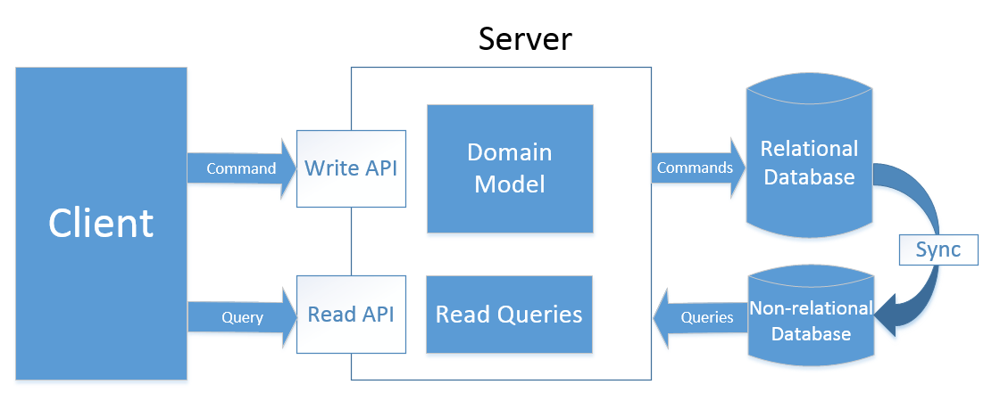

# CQRS Showcase

This project is a demonstration of the Command and Query Responsibility Segregation (CQRS) pattern using .NET 6. The showcase application uses Azure Cosmos DB Emulator as the read database and Microsoft SQL Server as the write database. The project includes sample code for implementing CQRS in a .NET application, along with instructions for setting up the required databases and deploying the application. This showcase can serve as a starting point for developers who are interested in implementing the CQRS pattern in their .NET applications using Cosmos DB and SQL Server.

## Table of Contents

- [Installation](#installation)
- [Usage](#usage)
- [Synchronization between databases](#synchronization)

## Installation

Instructions for installing the project.

## Usage

Instructions for using the project.

## Synchronization

