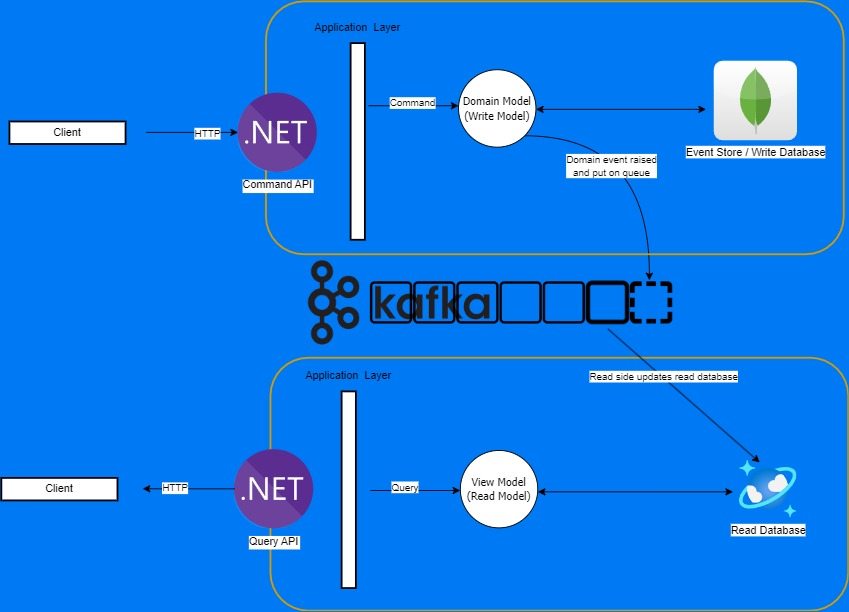

# CQRS Showcase

This project is a demonstration of the Command and Query Responsibility Segregation (CQRS) pattern using .NET 6. The showcase application uses Azure Cosmos DB Emulator as the read database and Microsoft SQL Server as the write database. The project includes sample code for implementing CQRS in a .NET application, along with instructions for setting up the required databases and deploying the application. This showcase can serve as a starting point for developers who are interested in implementing the CQRS pattern in their .NET applications using Cosmos DB and SQL Server.

## Table of Contents

- [CQRS Showcase](#cqrs-showcase)
  - [Table of Contents](#table-of-contents)
  - [Installation](#installation)
  - [Usage](#usage)
  - [Domain-Driven Design](#domain-driven-design)
    - [Bounded Context](#bounded-context)
  - [Azure Cosmos DB](#azure-cosmos-db)
  - [Synchronization](#synchronization)
  - [Troubleshooting](#troubleshooting)
  - [External documentation links](#external-documentation-links)

## Installation

Instructions for installing the project.

## Usage

Instructions for using the project.

## Domain-Driven Design

### Bounded Context
In DDD, a bounded context defines a specific problem area within a domain and may correspond to a separate microservice. For example, in the context of a social media application, a bounded context could be defined for post-related functions. This bounded context could then be implemented as a social media post microservice, which would handle all the functions related to creating, managing, and displaying posts.

In our showcase project, I will design and implement a social media post microservice using the CQRS pattern to handle all post-related functions, such as creating, editing, and displaying posts. By using CQRS, we can optimize the performance of the microservice and achieve scalability, flexibility, and maintainability in our application architecture.

## Azure Cosmos DB

## Synchronization

I created this topic on the discussion tab [Updating Read Databases in a CQRS Architecture](https://github.com/reinaldogez/cqrs-showcase/discussions/1), where the main options are deeply discussed.

## Troubleshooting

- **Error: "message error"** - If you're seeing this error message, you need to bla bla

## External documentation links
[Use the Azure Cosmos DB Emulator on Docker for Linux](https://learn.microsoft.com/en-us/azure/cosmos-db/docker-emulator-linux)
